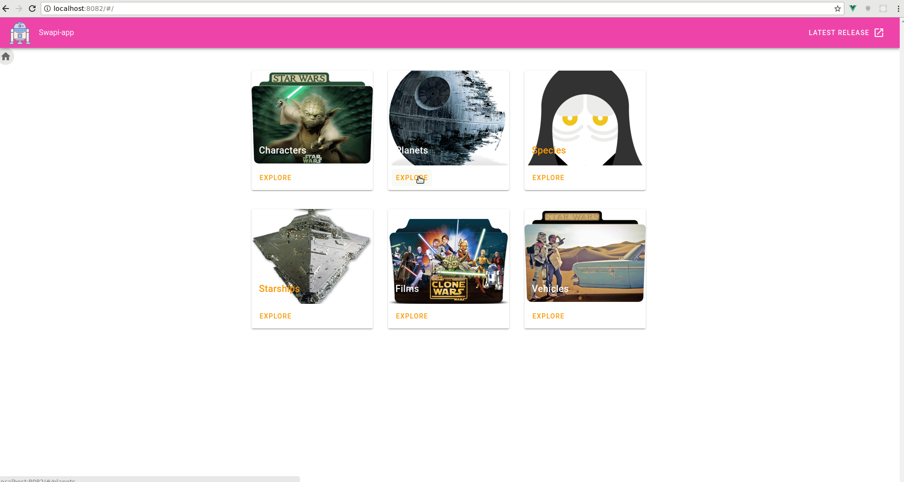
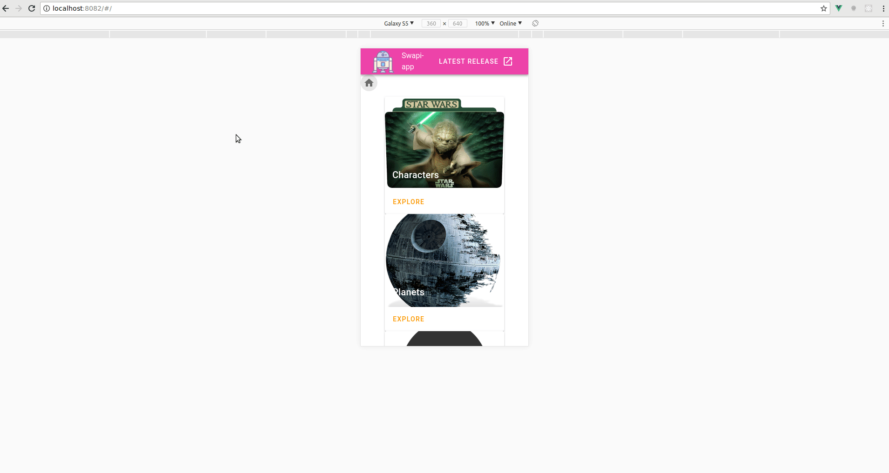
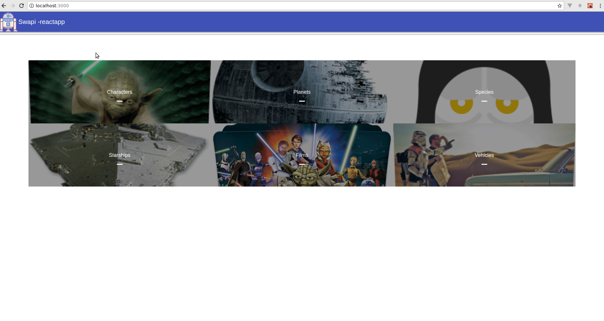

# swapi-gui
swapi gui vuejs vuex


# gif démo desktop 🖥️ 



# gif démo mobile 📱


# gif démo react



# first installation


```shell
#start backend appolo server
docker-compose up -d


#start frontend server for vuejs app
cd swapi-app
npm install
npm run serve

#or start frontend server for react js app
cd swapi-reactapp
npm install
npm start

```